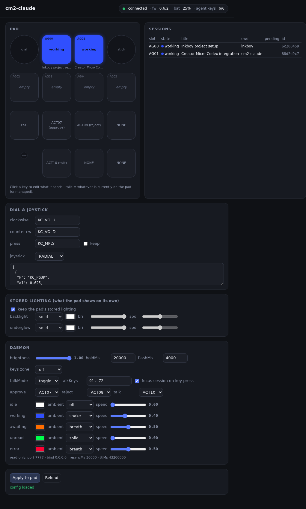
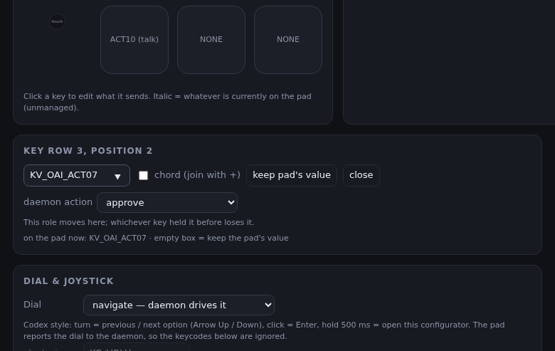

# cm2-claude

Claude Code agent status on a **Work Louder Creator Micro 2**: the Codex Micro's
Agent Keys, body-ring notification and approve/reject keys, driven by Claude Code
hooks instead of the ChatGPT app. Works over Bluetooth or USB, alongside the
Work Louder Input app, with the sessions running on a different machine than
the pad.

```
row 1   [dial] [AG00] [AG01] [joystick]      agent keys: one Claude Code session each
row 2   [AG02] [AG03] [AG04] [AG05]          white idle · blue working · amber needs input
row 3   [Esc ] [APPR] [REJ ] [ .. ]          green done (unread) · red error · selected key breathes
row 4   [TALK] [ .. ] [ .. ]                 body ring = most urgent state across all sessions
```

## How it works

* **cm2d** (`daemon/cm2d.js`, Node, runs on the Windows box the pad is paired to)
  opens the pad's vendor HID collection (usage page `0xFF00`) and speaks the
  firmware's JSON-RPC: `v.oai.thstatus` lights the six agent keys,
  `v.oai.rgbcfg` drives the body ring, `v.oai.hid` reports key presses. It
  also listens on HTTP (`:7777`) for Claude Code hook events.
* **hooks** (`hooks/cm2-hook.sh`, on every machine that runs Claude Code) POST
  each hook event to cm2d. All hooks are async and swallow failures, so a
  dead daemon never shows up in a session. `PermissionRequest` is the one
  synchronous hook: cm2d holds it open for `holdMs` so APPR/REJ on the pad can
  answer it; otherwise the normal on-screen prompt appears.

State per session, in the Codex Micro's own derivation and palette:

| Claude Code event | state | key |
|---|---|---|
| `SessionStart` | idle | white |
| `UserPromptSubmit`, `PreToolUse`, `PostToolUse` | working | blue |
| `PermissionRequest`, `Notification/permission_prompt`, `AskUserQuestion`, elicitations | awaiting | amber |
| `Stop` | unread (done, not looked at yet) | green |
| `StopFailure` | error | red |
| `SessionEnd` | slot freed | off |

Pressing an agent key selects that session (breathing) and acknowledges green/red
back to white. The next prompt you type clears them too. With more than six
sessions, the stalest one gives up its key, idle ones first.

### The state machine

One record per Claude Code session, keyed by `session_id`, driven only by hook
events. States and their key colours: **off** (no key), **idle** white,
**working** blue, **awaiting** amber, **unread** green, **error** red.

| From | Event | To |
|---|---|---|
| any | `SessionStart` (startup, resume, clear) | idle, gets a key |
| any | `SessionStart` (compact) | unchanged |
| any | `UserPromptSubmit`, `PostToolUse`, `PostToolUseFailure` | working |
| any | `PreToolUse` | working, or awaiting if the tool is `AskUserQuestion` |
| any | `PermissionRequest` | awaiting, and the prompt is held for the pad |
| any | `Notification` permission_prompt, elicitation dialogs, agent_needs_input | awaiting |
| any | `Notification` elicitation complete or response | working |
| any | `Stop` | unread |
| any | `StopFailure` | error |
| unread, error | its agent key pressed | idle (acknowledged); the key is also selected |
| any | `SessionEnd`, or 12 h without an event | off, key freed |

Pad side: APPR/REJ answer the held prompt of the selected session, else the only
held one, else nothing; the answered session goes to working. Selection toggles
on the same key; the selected key breathes, and for four seconds the other keys
flash the selected session's colour (Codex does the same). Selecting also asks
the Claude desktop app to open that session through its
`claude://code/continue?session=…` deep link, looked up by Claude Code id in the
app's session store (`%APPDATA%\Claude\claude-code-sessions`), which is also
where the titles in `/state` come from. That entry point is behind a server-side
feature flag in current builds (the app logs "code entry deep link gated off"),
so it does nothing yet; it starts working the day the flag flips. When all six keys are taken, the
stalest session gives its key up, idle and unread first, then error, working,
awaiting last. The ring shows the most urgent state present: awaiting > error >
unread > working > idle (off). Holding TALK turns every non-agent key red until
release. Daemon side: reconnect loop on any device error or three failed pushes;
lighting re-sent every 30 s; agent keys re-checked and, if Input is closed,
restored every 2 min.

### Hold-to-talk

The TALK key is an action key: the daemon gets its press and release and injects
a keyboard shortcut on the desktop at each edge (`talkKeys`, virtual-key codes,
default Win+H, and `talkMode`). `"toggle"` taps the chord on press and again on
release, which opens Windows voice typing while held and closes it after: the
dictated text lands in whatever has focus, so with the Claude window focused it
goes into the open session's prompt. While held, the non-agent keys glow red and
the ring runs Codex's green "recording" snake. `"hold"` keeps the chord pressed for the
duration, for a push-to-talk hotkey. The Windows Claude app exposes no dictation
hotkey in its config (its Caps Lock "speak to Claude" feature appears to be the
macOS quick-entry path); if a later build lists one under Keyboard Shortcuts, put
its virtual-key codes in `talkKeys` and set `talkMode` to `"hold"`.

Requires pad firmware **0.6.0 or newer** (`node cm2d.js status` prints it; the
Input app updates firmware). Firmware 0.6 is what put the `v.oai.*` methods on
every Creator Micro 2.

## Setup

On the machine with the pad (Windows, Node 18+):

```bash
scp -r daemon desktop:C:/Users/user/cm2-claude/
ssh desktop "cd C:\Users\user\cm2-claude\daemon && npm install --omit=dev"
ssh desktop "cd C:\Users\user\cm2-claude\daemon && node cm2d.js status"        # round trip over BLE/USB
ssh desktop "cd C:\Users\user\cm2-claude\daemon && node cm2d.js setup-keys"    # rows 1-2 -> agent keys, row 3 -> APPR/REJ (backs up first)
ssh desktop "cd C:\Users\user\cm2-claude\daemon && node cm2d.js install"       # logon task, starts now; `uninstall` reverts
ssh desktop "cd C:\Users\user\cm2-claude\daemon && node cm2d.js restart"       # after editing config.json or copying a new cm2d.js
```

The daemon keeps a pidfile, so starting a new instance (the task, or `restart`)
retires the old one instead of racing it for the port.

On every machine that runs Claude Code, install the hook side as a plugin (this
repo is also a Claude Code marketplace):

```bash
claude plugin marketplace add n4ru/cm2-claude
claude plugin install cm2-claude@cm2-claude
```

That registers the hooks and a `/cm2` command that shows what the pad is
displaying. The marketplace is cloned from GitHub, so the machine needs to be
able to clone this repository (it is private: `gh auth login`, or an SSH key on
the account). Where that is not possible, point the marketplace at a local copy
of this repo instead (`claude plugin marketplace add /path/to/cm2-claude`, then
the same `install`); that is how the desktop's WSL and its native Windows Claude
Code (the `claude.exe` bundled with the desktop app, found under
`%APPDATA%\Claude\claude-code\<version>\`) are set up, from the copy next to the
daemon in `C:\Users\user\cm2-claude`. On Windows the hook script runs under Git
Bash, which Claude Code needs anyway. `hooks/install-hooks.sh` remains as the
no-plugin fallback; it writes the hooks into `~/.claude/settings.json` directly.
A local-copy marketplace does not update itself: re-copy and
`claude plugin marketplace update cm2-claude` after pulling. The hook script posts to `CM2_URL` if set in your environment,
otherwise to the desktop's Tailscale address. If you installed the hooks the old
way with `hooks/install-hooks.sh`, run it again with `--remove` so events are
not sent twice. The daemon itself is not a plugin: something has to own the
pad's Bluetooth connection around the clock, hold permission prompts open and
reprogram the keymap, and a plugin only lives as long as a session.

From WSL on the desktop use the same Tailscale address; the WSL gateway address
does not reach the daemon.

Then open `http://<desktop>:7777/` for the configurator (next section).

Check: `node cm2d.js state` (or `curl http://desktop:7777/state`), `node cm2d.js demo`
walks six fake sessions through every colour, `node cm2d.js press AG00` simulates
a pad key (`press ACT10 0` a release), `type cm2d.log` on the desktop. The pad commands (`status`, `backup`,
`restore`, `setup-keys`) pause the daemon while they own the HID channel and
resume it afterwards.

## The configurator

The daemon serves its own configurator at `http://<desktop>:7777/` (any browser on
the tailnet), so the Input app is not needed for anything but firmware updates.



The pad is drawn live: agent keys in their session's colour with the session's
title underneath, the selected key pulsing, an amber dot on a session whose
permission prompt is waiting for APPR/REJ. Click any of the 13 keys to set what
it sends (a keycode from the catalogue, a chord such as `KC_LGUI+KC_H` that is
written to the pad as a macro, or "keep" to leave whatever the pad has). The dial,
the joystick, the pad's own stored lighting, and every daemon setting (state
colours, ring effects, hold-to-talk, brightness, hold time) are on the same page.



**Apply to pad** sends only the fields you changed to `POST /config`; the daemon
validates them against the pad's current keymap, saves `config.json`, reprograms
layer 1 over its own connection (no pause, no Input) and re-sends the lighting.
`GET /config` returns the effective config plus what is on the pad. Like `/hook`,
these answer any host that can reach the port.

## Keycaps (WRK MX Icon set + clear caps)

Clear caps on all six agent keys so the status colour shows through; icon caps
for the rest. Suggested default, mirroring the Codex Micro's positions:

```
row 1   [dial]        [clear]      [clear]      [joystick]
row 2   [clear]       [clear]      [clear]      [clear]
row 3   [■ stop]      [run]        [X]          [↶ undo]        stop = Esc (interrupt)   run/X = APPR/REJ (cm2d)   undo = Esc Esc (rewind)
row 4   [mic/globe]   [⊞ or ★]     [smiley]                     voice = Win+H (Windows voice typing)   new = Ctrl+N   smiley = focus Claude
```

Only `run` and `X` talk to cm2d (that is `actions` in the config, ACT07/ACT08).
`setup-keys` writes the whole of layer 1 from `layout` in the config. A cell is a
plain keycode (`"KC_ESC"`), a chord written to the pad as a macro
(`["KC_LGUI","KC_H"]` = Win+H: modifiers held, last key clicked, released), or
`null` to keep whatever is on the pad. Defaults: Esc on row 3 left (interrupts
Claude when the app is focused), the TALK action key on row 4 left, the rest
inert so the pad never types stray letters. Add
`["KC_LCTL","KC_N"]` or whatever you like and re-run `setup-keys`; macros cm2d
made are regenerated each time, macros you built in Input are left alone.
Icons are cosmetic; the switch positions are what matters.

## Config

This is the configurator. The pad's entire configuration is two JSON files on the
device (`keymap.json`, `smart_actions.json`); `backup` copies them out,
`restore` puts a copy back, `setup-keys` applies the config below to layer 1,
and the daemon drives lighting live. The original pre-cm2d keymap is kept as
`keymap.before.json` and every `setup-keys` leaves a timestamped
`keymap.backup-*.json` next to the daemon.

Optional `daemon/config.json`, any subset of the defaults at the top of `cm2d.js`:
`port`, `holdMs` (0 disables pad approvals), `brightness`, `colors`, `layout`,
`encoders`, `joystick`, `lights` (what `setup-keys` writes: the 13 keys, the
dial, the joystick and the pad's own stored lighting; null keeps what the pad
has), `talkKeys`/`talkMode` (hold-to-talk), `ambient`
(per-state body ring effect; `idle: {effect: "off"}` mirrors Codex, or give it a
colour), `keys` (backlight of the non-agent keys: `"off"` by default so the
status keys pop, like Codex; `"keymap"` for the pad's stored backlight; or an
explicit `{effect,color,brightness}`), `actions` (which ACT keys are approve/reject).

## Caveats

* Agent keys and APPR/REJ stop typing; they only report to cm2d. `setup-keys`
  saves the previous keymap next to the daemon first; `node cm2d.js restore
  <backup>` puts it back.
* **You do not need the Work Louder Input app.** cm2d reads and writes the keymap,
  drives all three lighting zones, writes macros, and receives key events on its
  own. Input is only for firmware updates: open it, update, close it. **It will
  break this while it runs.**
  It syncs its own stored profile onto the pad, which replaces the agent keycodes
  with plain letters; after that every lighting command is still acknowledged
  with `{ok:1}` and renders nothing (the ring and backlight keep working, the
  per-key status dies silently). cm2d checks the active layer on connect and every
  two minutes, reports `agentKeys` in `/state`, and puts the `KV_OAI_*` keys back
  by itself, but only while Input is not running. Keep Input closed; open it for
  firmware updates and close it again. It relaunches at login through the
  `input` value under `HKCU\Software\Microsoft\Windows\CurrentVersion\Run`
  (`"C:\Users\user\AppData\Local\Programs\input\input.exe" --autostart`);
  remove that value to stop it.
* `node cm2d.js stop && node probe.js` drives the pad directly with a bright
  test pattern and prints every firmware reply. An acknowledgement proves the
  command was accepted, not that anything lit; only eyes on the pad settle that.
* Lighting sent over `v.oai.*` is volatile: the pad reverts to its stored
  lighting on power-cycle or layer change, so cm2d re-sends every 30 s.
* The pad has no way to focus a session in the Claude desktop app, so an agent
  key press selects and acknowledges, nothing more.
* One daemon owns the pad. `run` writes `cm2d.pid` and retires any older instance
  on startup (asking it to quit gracefully first, so it blanks the pad); if the
  pad ever freezes, `node cm2d.js restart` is the reset. The session table is
  saved to `sessions.json` and restored on start, so a restart keeps the keys lit.
* `/hook` and `/state` are open to whatever can reach the port (your tailnet);
  `/key` and `/quit` only answer from the desktop itself. Nothing on the wire is
  authenticated beyond that, so keep the port off untrusted networks.
* APPR/REJ answer the selected session's prompt, or the only pending one. With
  several pending and none selected they do nothing but log; press the amber
  session's agent key first.

Protocol facts come from the community write-ups
([cm2-agent-keys](https://github.com/honest-andy/cm2-agent-keys),
[freemicro](https://github.com/eliBenven/freemicro),
[micro2-configurator](https://github.com/egegungordu/micro2-configurator)) and
the `@worklouder/wl-device-kit` bundle shipped inside the Input app. Not
affiliated with Work Louder or OpenAI.
