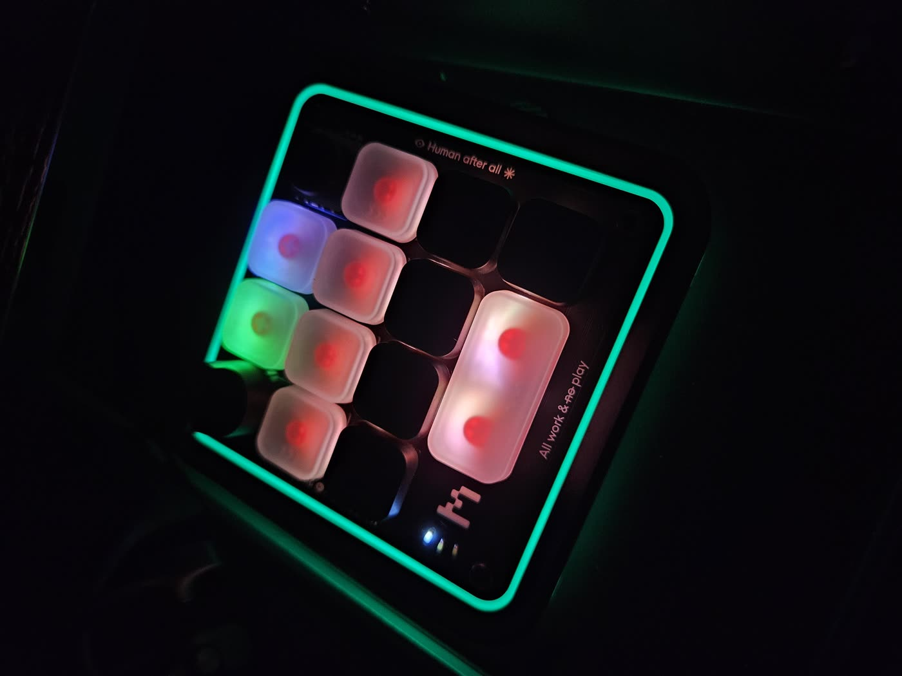

# cm2-claude

Claude Code agent status on a **Work Louder Creator Micro 2**: the Codex Micro's
Agent Keys, body-ring notification, approve/reject keys and hold-to-talk, driven
by Claude Code hooks instead of the ChatGPT app. Bluetooth or USB, sessions on any
machine on your tailnet, no Work Louder Input app needed.



```
row 1   [dial] [AG00] [AG01] [joystick]      agent keys: one Claude Code session each
row 2   [AG02] [AG03] [AG04] [AG05]          white idle · blue working · amber needs input
row 3   [Esc ] [APPR] [REJ ] [ .. ]          green done (unread) · red error · selected key breathes
row 4   [TALK] [ .. ] [ .. ]                 body ring = most urgent state across all sessions
```

- [Install](#install)
- [The configurator](#the-configurator)
- [What the keys do](#what-the-keys-do)
- [The Codex behaviours](#the-codex-behaviours)
- [The state machine](#the-state-machine)
- [Hold-to-talk](#hold-to-talk)
- [Config reference](#config-reference)
- [Caveats](#caveats)

## How it works

* **cm2d** (`daemon/cm2d.js`, Node, runs on the Windows box the pad is paired to)
  opens the pad's vendor HID collection (usage page `0xFF00`) and speaks the
  firmware's JSON-RPC: `v.oai.thstatus` lights the six agent keys,
  `v.oai.rgbcfg` drives the body ring, `v.oai.hid` reports key presses. It also
  listens on HTTP (`:7777`) for Claude Code hook events and serves the
  configurator.
* **the plugin** (this repo is a Claude Code marketplace) registers hooks on every
  machine that runs Claude Code. Each hook event is POSTed to cm2d over the
  tailnet, asynchronously, swallowing failures, so a dead daemon never shows up
  in a session. `PermissionRequest` is the one synchronous hook: cm2d holds it
  open so APPR/REJ on the pad can answer it, and the normal on-screen prompt
  appears if nothing is pressed within `holdMs`.

Only the daemon has to sit next to the pad. Sessions on rpc, in WSL, or in the
desktop app's native Windows Claude Code all light the same keys.

Requires pad firmware **0.6.0 or newer** (`node cm2d.js status` prints it;
firmware 0.6 is what put the `v.oai.*` methods on every Creator Micro 2).

## Install

**On the machine with the pad** (Windows, Node 18+), there are two ways to run
the daemon, and they coexist:

*Started by the plugin.* If Claude Code itself runs on that machine (the desktop
app's native sessions, or the CLI), the plugin's `SessionStart` hook takes care
of it: the first time, it does the `npm install` in the plugin's own copy of the
daemon and registers the `cm2d` logon task (user-level, no admin), which starts
the daemon now and at every login; after that it just runs the task whenever a
session starts and the daemon isn't answering. Nothing else to set up.
`CM2_NO_DAEMON=1` opts out entirely; `CM2_NO_AUTOSTART=1` skips the task and
starts the daemon detached from the session instead.

The task matters: the daemon injects keystrokes (dial, mic, typed answers), so
it has to live in the interactive Windows session, and a process started from
an SSH session cannot. That is also why a session running *elsewhere* can only
revive the daemon through the task: put the pad machine's SSH host name in
`~/.config/cm2-claude/ssh` (one line, e.g. `desktop`) on the machine your
sessions run on, and the hook there runs `schtasks /Run /TN cm2d` over SSH when
the daemon doesn't answer.

*Started at login, by hand.* If Claude Code never runs on the pad's machine,
install the same task yourself from a checkout:

```bash
scp -r daemon desktop:C:/Users/user/cm2-claude/
ssh desktop "cd C:\Users\user\cm2-claude\daemon && npm install --omit=dev"
ssh desktop "cd C:\Users\user\cm2-claude\daemon && node cm2d.js status"        # round trip over BLE/USB
ssh desktop "cd C:\Users\user\cm2-claude\daemon && node cm2d.js setup-keys"    # rows 1-2 -> agent keys, row 3 -> APPR/REJ, row 4 -> TALK (backs up first)
ssh desktop "cd C:\Users\user\cm2-claude\daemon && node cm2d.js install"       # logon task, starts now; `uninstall` reverts
ssh desktop "cd C:\Users\user\cm2-claude\daemon && node cm2d.js restart"       # after editing config.json or copying a new cm2d.js
```

Either way the daemon's state (config, sessions, pidfile, log, keymap backups)
lives in `%APPDATA%\cm2-claude` on Windows or `~/.config/cm2-claude` elsewhere
(`CM2_HOME` overrides), so plugin updates never lose your configuration. The
pidfile means a new instance retires the old one instead of racing it for the
port. Close the Work Louder Input app and stop it launching at login (see
[Caveats](#caveats)).

**On every machine that runs Claude Code:**

```bash
claude plugin marketplace add n4ru/cm2-claude
claude plugin install cm2-claude@cm2-claude
```

That registers the hooks and a `/cm2` command that shows what the pad is
displaying. The marketplace is cloned from GitHub, so the machine needs to be
able to clone this repository (it is private: `gh auth login`, or an SSH key on
the account). Where that is not possible, point the marketplace at a local copy
instead (`claude plugin marketplace add /path/to/cm2-claude`, then the same
`install`); that is how the desktop's WSL and its native Windows Claude Code
(the `claude.exe` bundled with the desktop app, under
`%APPDATA%\Claude\claude-code\<version>\`) are set up, from the copy next to the
daemon. On Windows the hook script runs under Git Bash, which Claude Code needs
anyway. A local-copy marketplace does not update itself: re-copy, then
`claude plugin marketplace update cm2-claude`.

**Configuring the plugin.** Claude Code plugins have no settings page, and this
one needs exactly one setting: where the daemon is. The hook script uses
`CM2_URL` from the environment if set, else the single line in
`~/.config/cm2-claude/url` (for example `http://100.124.22.74:7777`), else
`http://127.0.0.1:7777`. Write that file on every machine whose sessions should
reach a daemon elsewhere; on the pad's own machine the default is right.
Everything else (keys, colours, hold time, talk key) is configured in the
daemon's own page, not in the plugin. `/cm2` prints which address it is using.
From WSL use the desktop's Tailscale address; the WSL gateway does not reach the
daemon. `hooks/install-hooks.sh` is the no-plugin fallback (writes the hooks into
`~/.claude/settings.json`; `--remove` takes them out). Sessions already running
when the plugin is installed keep the hooks they started with; new sessions use
the plugin.

Android: Claude Code runs there only under Termux, where the plugin works like
anywhere else, so a Termux session lights the pad. The daemon cannot run on
Android without a native app: over USB an app can claim the pad's HID interface
without root; over Bluetooth, Android hides the HID service from non-system
apps.

Check: `/cm2` in any session, `node cm2d.js state` (or
`curl http://desktop:7777/state`), `node cm2d.js demo` walks six fake sessions
through every colour, `node cm2d.js press AG00` simulates a pad key
(`press ACT10 0` a release), `type cm2d.log` on the desktop. The pad commands
(`status`, `backup`, `restore`, `setup-keys`) pause the daemon while they own the
HID channel and resume it afterwards.

## The configurator

The daemon serves its own configurator at `http://<desktop>:7777/` (any browser
on the tailnet).


The pad is drawn live: agent keys in their session's colour with the session's
title underneath, the selected key pulsing, an amber dot on a session whose
permission prompt is waiting for APPR/REJ. Click any of the 13 keys to set what
it sends: a keycode from the catalogue, a chord such as `KC_LGUI+KC_H` that is
written to the pad as a macro, or "keep" to leave whatever the pad has.


The dial, the joystick, the pad's own stored lighting, and every daemon setting
(state colours, ring effect per state, hold-to-talk, brightness, hold time,
which action keys mean what) are on the same page. **Apply to pad** sends only
the fields you changed to `POST /config`; the daemon validates them against the
pad's current keymap, saves `config.json`, reprograms layer 1 over its own
connection and re-sends the lighting. `GET /config` returns the effective config
plus what is on the pad. Like `/hook`, these answer any host that can reach the
port.

## What the keys do

Clear caps on the six agent keys so the status colour shows through; icon caps
for the rest (WRK MX Icon set). Positions mirror the Codex Micro:

```
row 1   [dial]        [clear]      [clear]      [joystick]
row 2   [clear]       [clear]      [clear]      [clear]
row 3   [■ stop]      [run]        [X]          [ .. ]          stop = Esc (interrupt)   run / X = APPR / REJ (answered by cm2d)
row 4   [mic]         [ .. ]       [ .. ]                       mic = TALK: hold to dictate (Windows voice typing while held)
```

- **Agent key**: selects that session (its key breathes, the other keys flash
  its colour for four seconds) and acknowledges green/red back to white. It also
  asks the Claude desktop app to open that session through its
  `claude://code/continue` deep link; that entry point is behind a server-side
  feature flag in current builds, so it is inert until the flag flips.
- **APPR / REJ**: answer the held permission prompt of the selected session, else
  the only pending one; with several pending and none selected they do nothing
  but log, so press the amber session's key first.
- **TALK**: see [Hold-to-talk](#hold-to-talk).
- **Esc** on row 3 left, and the spare keys are inert, so the pad never types
  stray letters. The dial is volume; the joystick pages up/down and sends Esc
  (left) or Enter (right). All of it is in `layout`, `encoders` and `joystick`
  in the config and editable in the configurator.

`setup-keys` writes layer 1 from the config. A cell is a plain keycode
(`"KC_ESC"`), a chord written to the pad as a macro (`["KC_LGUI","KC_H"]`:
modifiers held, last key clicked, released), a `KV_OAI_*` action or agent key,
or `null` to keep whatever the pad has. Macros cm2d made are regenerated each
time; macros you built elsewhere are left alone.

## The Codex behaviours

Everything the ChatGPT app does with the Codex Micro (from the freemicro
project's teardown of that app) is reproduced, minus its onboarding animation and
mini-game. All of it is on by default and switchable in the configurator.

| Codex | here |
|---|---|
| **Dial** turns move the highlight (Arrow Up / Down), click is Enter, hold 500 ms opens settings; using it puts the pad in "navigating": blue snake ring, and AG00 turns red and acts as Escape | `dial: "navigate"`: identical, hold opens this configurator; "navigating" lasts 2 s after the last dial event (Codex knows when a menu is open; we don't). `dial: "keymap"` restores plain keycodes from `encoders` |
| **Stick** fires one command per push past half deflection, re-arms at rest; up plan mode, down sidebar, left back, right forward | `stick.mode: "vendor"` with the same deadzones and edge trigger; each direction is a chord of virtual-key codes, default Shift+Tab, Ctrl+B, Alt+Left, Alt+Right. `"keymap"` restores `joystick` |
| **Agent keys** show the six most recently updated threads, most recent first | `agentSource: "recent"` (keys re-sort as sessions become active) or `"sticky"` (a session keeps its key) |
| single tap opens the thread in the background, double tap within 350 ms also raises the window | tap selects and acknowledges (and fires the gated deep link); double tap within `doubleTapMs` raises the Claude window |
| the selected thread's green clears when the window is focused | `focusDowngrade`: the daemon polls the foreground window; when it is Claude, the selected session's green turns white |
| ring: only the selected thread working (blue snake), a 4 s flash on selection change, voice states | `ambientMode: "codex"` does exactly that; `"urgent"` (default) shows the most urgent state of any session instead. Recording = green snake either way |
| key backlight off; brightness 0–100 | `keys: "off"`, `brightness` |
| **auto-dim** after 3 min without input or change; any key, stick past 10 %, or status change wakes it | `autoDimMs` (0 = never); same wake rules |
| **MIC**: hold to talk; tap then tap again within 350 ms latches recording; any tap stops | the TALK key runs the same four-state machine on `doubleTapMs` |
| 37 keycaps with built-in commands; YOLO/YEET type into the composer | `actionKeys`: any action key can send a chord, type text (with or without Enter), raise the Claude window, or open the configurator |
| writes coalesced, identical payloads skipped, blank on quit, reconnect backoff, battery polled | same (80 ms coalescing, dedupe, blank on quit, reconnect loop, status every 2 min) |

## The state machine

One record per Claude Code session, keyed by `session_id`, driven only by hook
events. States and their key colours are the Codex Micro's own palette: **off**
(no key), **idle** white, **working** blue, **awaiting** amber, **unread**
green, **error** red.

| From | Event | To |
|---|---|---|
| any | `SessionStart` (startup, resume, clear) | idle, gets a key |
| any | `SessionStart` (compact) | unchanged |
| any | `UserPromptSubmit`, `PostToolUse`, `PostToolUseFailure` | working |
| any | `PreToolUse` | working, or awaiting if the tool is `AskUserQuestion` |
| any | `PermissionRequest` | awaiting, and the prompt is held for the pad |
| any | `Notification` permission_prompt, elicitation dialogs, agent_needs_input | awaiting |
| any | `Notification` elicitation complete or response | working |
| any | `Stop` | unread |
| any | `StopFailure` | error |
| unread, error | its agent key pressed | idle (acknowledged); the key is also selected |
| any | `SessionEnd`, or 12 h without an event | off, key freed |

When all six keys are taken, the stalest session gives its key up, idle and
unread first, then error, working, awaiting last. The ring shows the most urgent
state present: awaiting > error > unread > working > idle (off). Daemon side:
reconnect loop on any device error or three failed pushes; lighting re-sent
every 30 s; the config reconciled onto the pad on every connect; agent keys
re-checked and, if Input is closed, restored every 2 min; the session table
saved to `sessions.json` so a restart keeps the keys lit.

## Hold-to-talk

The TALK key is an action key: the daemon gets its press and release and injects
a keyboard shortcut on the desktop at each edge (`talkKeys`, virtual-key codes,
default Win+H, and `talkMode`). `"toggle"` taps the chord on press and again on
release, which opens Windows voice typing while held and closes it after: the
dictated text lands in whatever has focus, so with the Claude window focused it
goes into the open session's prompt. While held, the non-agent keys glow red and
the ring runs Codex's green "recording" snake. `"hold"` keeps the chord pressed
for the duration, for a push-to-talk hotkey. The Windows Claude app exposes no
dictation hotkey in its config (its Caps Lock "speak to Claude" feature appears
to be the macOS quick-entry path); if a later build lists one under Keyboard
Shortcuts, put its virtual-key codes in `talkKeys` and set `talkMode` to
`"hold"`.

## Config reference

The pad's entire configuration is two JSON files on the device (`keymap.json`,
`smart_actions.json`); `backup` copies them out, `restore` puts a copy back,
`setup-keys` applies the config to layer 1, and the daemon drives lighting live.
The original pre-cm2d keymap is kept as `keymap.before.json` and every
`setup-keys` leaves a timestamped `keymap.backup-*.json` next to the daemon.

Optional `daemon/config.json`, any subset of the defaults at the top of
`cm2d.js` (the configurator writes it for you): `port`, `bind`, `holdMs` (0
disables pad approvals), `brightness`, `colors`, `ambient` (per-state body ring
effect; `idle: {effect: "off"}` mirrors Codex, or give it a colour), `keys`
(backlight of the non-agent keys: `"off"` by default so the status keys pop, like
Codex; `"keymap"` for the pad's stored backlight; or an explicit
`{effect,color,brightness}`), `actions` (which ACT keys are approve, reject and
talk), `talkKeys`/`talkMode`, `focusOnPress`, `flashMs`, `layout`, `encoders`,
`joystick`, `lights` (what `setup-keys` writes: the 13 keys, the dial, the
joystick and the pad's own stored lighting; null keeps what the pad has),
`dial`, `stick`, `actionKeys`, `autoDimMs`, `agentSource`, `doubleTapMs`,
`focusDowngrade`, `ambientMode` (the [Codex behaviours](#the-codex-behaviours)).

## Caveats

* **You do not need the Work Louder Input app, and it will break this while it
  runs.** It syncs its own stored profile onto the pad, which replaces the agent
  keycodes with plain letters; after that every lighting command is still
  acknowledged with `{ok:1}` and renders nothing (the ring and backlight keep
  working, the per-key status dies silently). cm2d checks the active layer on
  connect and every two minutes, reports `agentKeys` in `/state`, and puts the
  `KV_OAI_*` keys back by itself, but only while Input is not running. Open Input
  for firmware updates, then close it. It relaunches at login through the `input`
  value under `HKCU\Software\Microsoft\Windows\CurrentVersion\Run`
  (`"C:\Users\user\AppData\Local\Programs\input\input.exe" --autostart`); remove
  that value to stop it.
* Agent keys, APPR/REJ and TALK stop typing; they only report to cm2d.
  `node cm2d.js restore <backup>` puts the old keymap back.
* The round **touch sensor** at bottom-left cycles the pad's Bluetooth host slot.
  Brushing it disconnects the pad from this PC and puts it into advertising (blue
  flashing) on another slot; the three white LEDs show the active slot. cm2d
  reconnects within seconds once it is back.
* `node cm2d.js stop && node probe.js` drives the pad directly with a bright test
  pattern and prints every firmware reply. An acknowledgement proves the command
  was accepted, not that anything lit; only eyes on the pad settle that.
* Lighting sent over `v.oai.*` is volatile: the pad reverts to its stored
  lighting on power-cycle or layer change, so cm2d re-sends every 30 s.
* `/hook`, `/state` and `/config` are open to whatever can reach the port (your
  tailnet); `/key` and `/quit` only answer from the desktop itself. Nothing on the
  wire is authenticated beyond that, so keep the port off untrusted networks.

Protocol facts come from the community write-ups
([cm2-agent-keys](https://github.com/honest-andy/cm2-agent-keys),
[freemicro](https://github.com/eliBenven/freemicro),
[micro2-configurator](https://github.com/egegungordu/micro2-configurator)), the
`@worklouder/wl-device-kit` bundle shipped inside the Input app, and freemicro's
extraction of the Codex Micro palette and behaviour from the ChatGPT desktop app.
Not affiliated with Work Louder, OpenAI or Anthropic.
